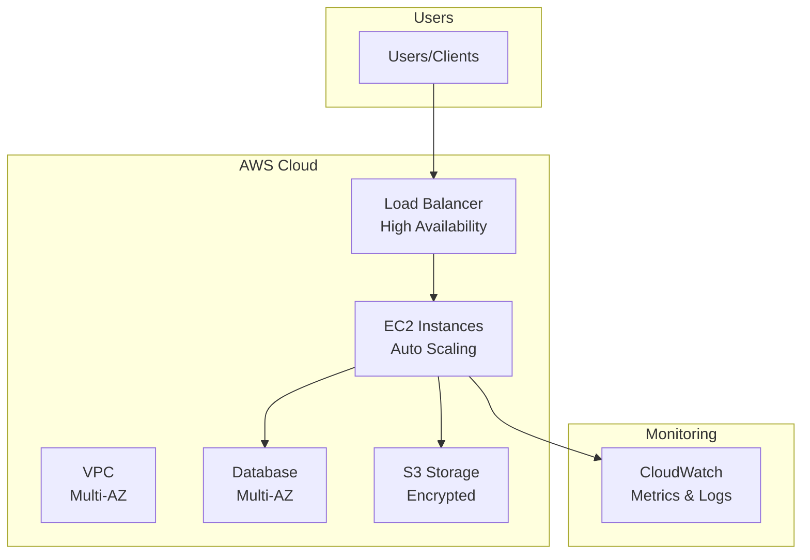
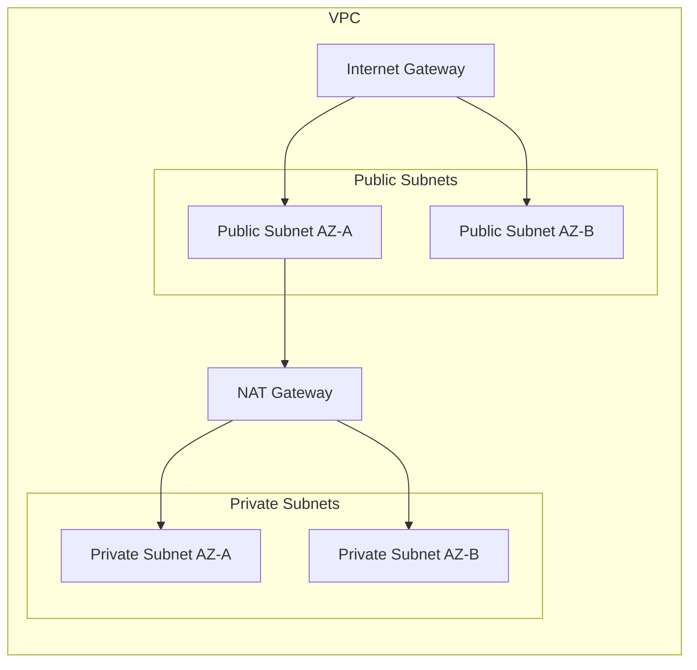
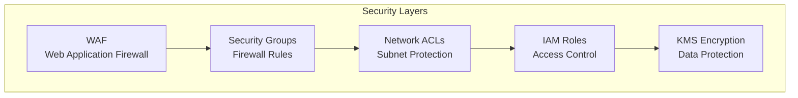
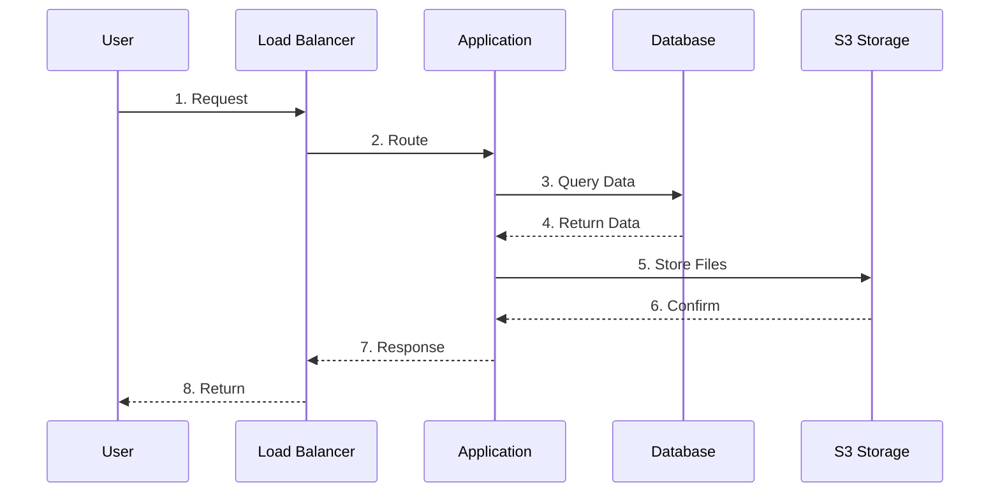
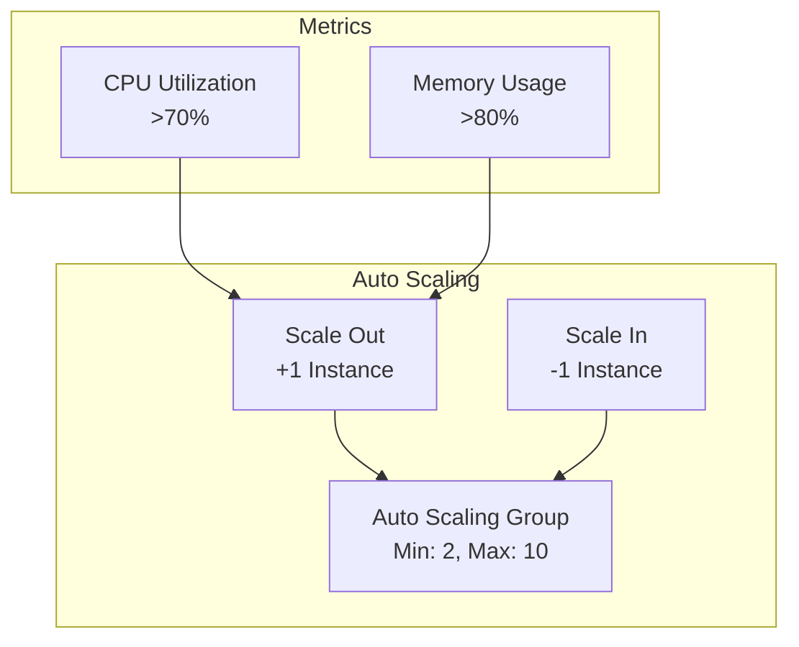
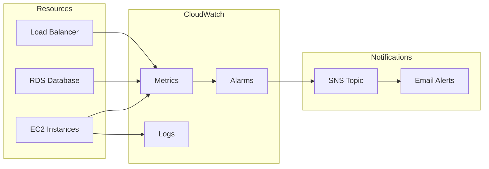
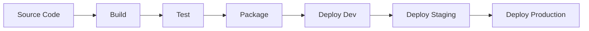
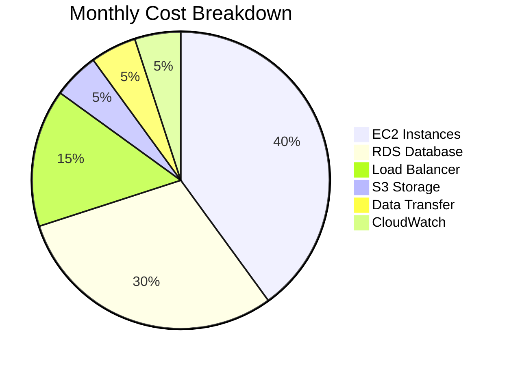

# Architecture Diagrams - Secure Web Infrastructure

Comprehensive Mermaid diagrams for the infrastructure.

## 1. Overall Architecture

## 2. Network Architecture

## 3. Security Architecture

## 4. Data Flow

## 5. Auto-Scaling

## 6. Monitoring & Alerts

## 7. Deployment Flow

## 8. Cost Distribution

---

## Key Features

- **High Availability**: Multi-AZ deployment
- **Auto Scaling**: Based on metrics
- **Security**: WAF, Security Groups, Encryption
- **Monitoring**: CloudWatch metrics and alarms
- **Cost Optimized**: Right-sized resources

---

**Author**: Rahul Ladumor  
**License**: MIT 2025
